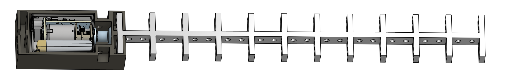
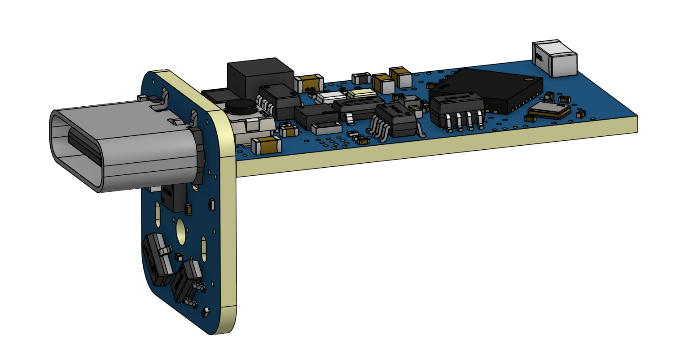

# **SoftSnap: A Modular and Untethered Soft Robotics Platform**  

## 🚀 Overview  
SoftSnap is a **modular, untethered soft robotics system** designed for **rapid prototyping** and exploration of **bio-inspired locomotion and manipulation tasks**. It enables researchers, educators, and hobbyists to quickly assemble **snap-together robotic modules** with integrated **cable-driven actuation, onboard control, and wireless communication**.

### 🎥 Demonstration Video
Watch the SoftSnap in action:

<iframe width="560" height="315" 
    src="https://www.youtube.com/embed/SWuYzo7xSno" 
    frameborder="0" allowfullscreen>
</iframe>

---

### **🔹 SoftSnap Full Assembly**
  

### **🔹 3-in-1 Motor Module PCB**
  

---

## 📦 Open-Source Resources  
This repository provides **open-source resources**, including:  
✅ **CAD models** for SoftSnap skeletons, connectors, and casing.  
✅ **PCB designs** for the integrated control system.  
✅ **Jupyter Notebook-based code** for forward and inverse simulation.  
✅ **Assembly guidelines** to build and modify SoftSnap robots (see the video). 

---

## 🔧 Features  
- 🛠 **Modular Design**: Easily snap together different modules to create robots like starfish-inspired, brittle-star locomotion, snake-like, grippers, and ring-based caging systems.  
- 🎛 **Cable-Driven Actuation**: Uses a **motorized winch system** to control flexible TPU-based skeleton deformation.  
- 📡 **Wireless Control**: Supports remote control via **Wi-Fi-based communication**.  
- 🔄 **Open-Source & Customizable**: Modify, 3D print, and expand the system to fit specific applications.  
- 🔬 **Simulation & Modeling**: Includes Jupyter Notebook tools for **predicting deformation behavior** and optimizing threading patterns.  

---

## 📂 Repository Structure  

```
📦 SoftSnap  
 ├── hardware/                   # CAD models & PCB design  
 │   ├── pcb/                    # PCB design files  
 │   │   ├── pcb_render.png       # PCB design image  
 │   │   ├── README.md            # PCB design documentation  
 │   ├── cad/                     # 3D models and shell for 3-in-1 Motor Module  
 │   │   ├── softsnap_module.png  # Full SoftSnap module image  
 │   │   ├── README.md            # 3D model printing & assembly guide  
 ├── software/                    # Jupyter Notebook-based simulation & control code  
 │   ├── forward_simulation.ipynb # Forward kinematics simulation  
 │   ├── inverse_simulation.ipynb # Inverse kinematics simulation  
 │   ├── README.md                # Simulation documentation  
 ├── LICENSE                      # License file  
 ├── README.md                    # Main repository documentation  
```

---

## 📦 Getting Started  

### 🔩 1️⃣ Hardware Requirements  
To build a SoftSnap module, you will need:  
- **3D-printed components** (TPU skeleton, PLA connectors, resin casing)  
- **Motor module** (GA12-N20 motor, PCB, Li-ion battery)  
- **8-braid No. 2 PE fishing line** (0.23mm, 12.7 kg tensile strength)  
- **Microcontroller & Wi-Fi module** (for remote operation)  

Refer to the **assembly guide** in the `docs/` folder for detailed instructions.  

### 🖥 2️⃣ Running the Jupyter Notebook Code  
The simulation, forward and inverse modeling, and control scripts are provided as Jupyter Notebooks for ease of use.  

1. Clone this repository:  
   ```bash
   git clone https://github.com/luyangzhao/SoftSnap.git  
   cd SoftSnap
   ```  
2. Open the Jupyter Notebook:  
   ```bash
   jupyter notebook  
   ```  
3. Navigate to the **software/** directory and run the desired notebook.

---

## 🔋 Battery Life & Actuation Cycles  
The **200 mAh battery** provides a theoretical energy capacity of **0.2 × 3.7V = 0.74 Wh**. Under a nominal load, the motor consumes approximately **160 mA × 12V × 1s = 0.000533 Wh** per cycle, yielding a theoretical estimate of **1388 cycles** per full charge.  
However, real-world performance varies due to energy losses, standby consumption, and load fluctuations. Experimental testing with the **XX skeleton configuration** resulted in **XX cycles per full charge**.

---

## 📜 Documentation  
📄 **Paper Reference**: [SoftSnap: Rapid Prototyping of Untethered Soft Robots](https://arxiv.org/abs/2410.19169)  

📜 **CAD & PCB Files**: `/hardware/`  

💻 **Jupyter Notebook Code**: `/software/`  

🛠 **Assembly Guide & Tutorials**: `/docs/`  

🔗 **GitHub Repository**: [https://github.com/luyangzhao/SoftSnap](https://github.com/luyangzhao/SoftSnap)  

---

## 🔬 Citation  
If you use SoftSnap in your research, please cite our work:  


```
Zhao, L., Jiang, Y., She, C., Chen, M., Balkcom, D., 2024. SoftSnap: Rapid Prototyping of Untethered Soft Robots Using Snap-Together Modules. Soft Robotics. DOI: arXiv:2410.19169
```


```
@article{zhao2024softsnap,
  title={SoftSnap: Rapid prototyping of untethered soft robots using snap-together modules},
  author={Zhao, Luyang and Jiang, Yitao and She, Chun-Yi and Chen, Muhao and Balkcom, Devin},
  journal={arXiv preprint arXiv:2410.19169},
  year={2024}
}
```


---

## 📝 License  
📜 This project is licensed under the **MIT License**. The terms are give in: https://opensource.org/license/mit.
