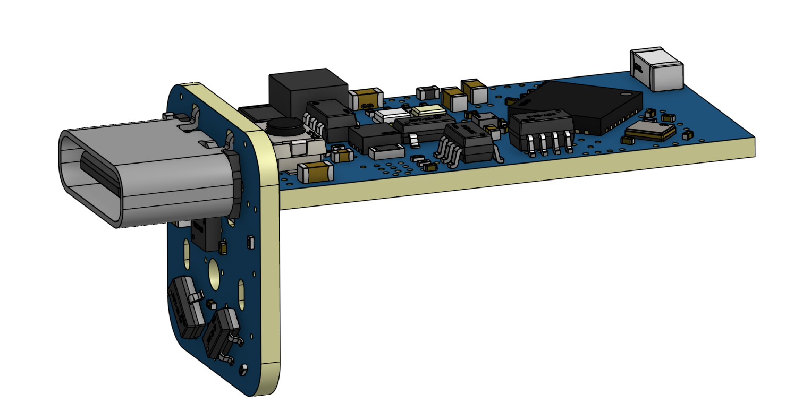

# **PCB Design for SoftSnap 3-in-1 Motor Module**  

## 🔗 Access the PCB Design  
The full **schematic, layout, and fabrication files** for the **3-in-1 Motor Module PCB** are available on **OSHWHub**:  
👉 [View the PCB Design on OSHWHub](https://oshwhub.com/cccat/universal-design)  

## 🖼️ PCB Model  
Below is the **3D-rendered PCB design** of the **3-in-1 Motor Module**:  

  

*(If the image is not displayed, ensure `pcb_render.png` is inside the `hardware/pcb/` folder.)*  

## 🛠️ About This PCB  
This **custom PCB** integrates the **motor driver, Wi-Fi module, and power management** for the SoftSnap **3-in-1 Motor Module**.  

The PCB design process consists of **four key steps**:  
1️⃣ **Schematic Design** – Creating the circuit diagram and selecting components.  
2️⃣ **Component Layout** – Arranging components efficiently on the board.  
3️⃣ **Routing** – Connecting electrical traces to ensure proper functionality.  
4️⃣ **Final Adjustments** – Ground planes, vias, silkscreen labeling, and other optimizations.  

## 📂 How to Use  
- To **modify the PCB**, download the **KiCAD/Eagle files** from OSHWHub.  
- To manufacture the board, use the **Gerber files** provided in the OSHWHub repository.  

For **assembly instructions and wiring details**, refer to the **main SoftSnap documentation** in the `/docs/` folder.  
